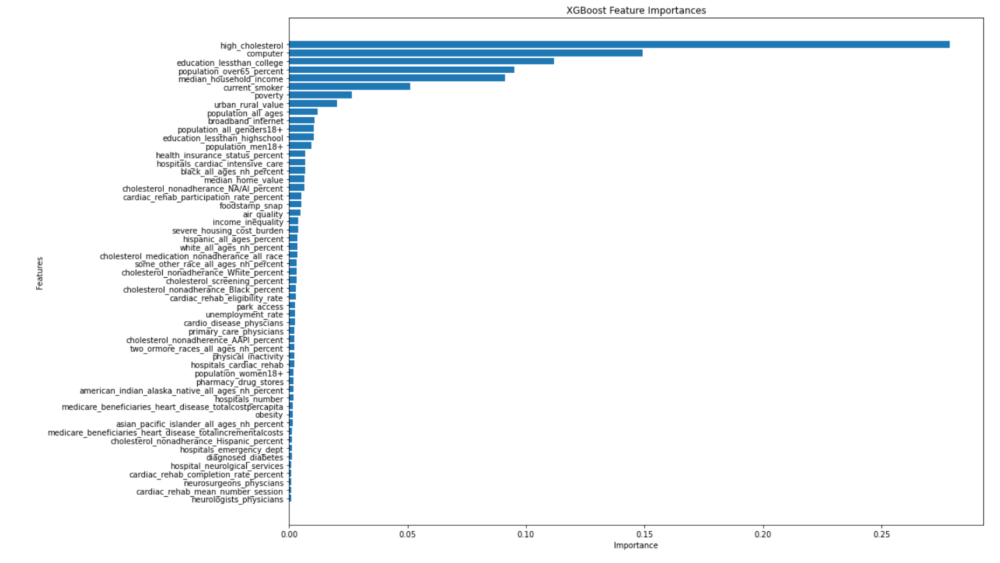

# Predicting Coronary Heart Disease
[The Erdős Institute](https://www.erdosinstitute.org/) Fall 2023 Bootcamp

by Henri Antikainen, Rachel Appel, Melanie King, Sriram Raghunath, Shanise Walker

# Project Description
description needed. 

# Dataset

The dataset is gathered from the  Center for Disease Control and Prevention’s Interactive Atlas of Heart Disease and Stroke (IAHDS) online mapping tool. County-level data for 3226 counties in the United States is gathered on coronary heart disease. The dataset consists of 59 features-including 5 risk factors, 14 social, economic, and environmental features, 12 demographic features, 21 healthcare delivery and insurance features, and 4 healthcare costs features. The data for each feature was gathered from a variety of sources between 2016-2020 and placed into the IAHDS interactive mapping tool. The [features key](https://github.com/shanise1/PCD/blob/main/Dataset%20Features%20Key.pdf) provides a detail description of each feature.  

# Model Approach 

Add information about models here. 

# Results 

# Future Work 

Add future work here. 

# Dependencies
Add the packages we used like LassoCV, XGboost, GaussianNaiveBayes, matlibplots, etc. 

